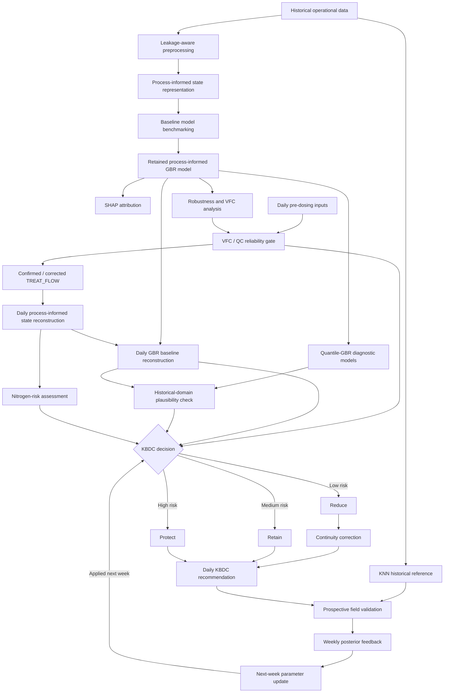

# KBDC-WWTP

**Knowledge-Embedded Baseline Dosing Control for Risk-Constrained Carbon Optimization in Wastewater Treatment**

Research code associated with the manuscript:

**Expert Prior Knowledge Embedded Machine Learning for Carbon Source Optimization in Wastewater Treatment Systems**

KBDC is a knowledge-embedded and risk-constrained framework for external-carbon dosing in wastewater treatment plants (WWTPs).

Instead of treating historical operator dosing as an optimal carbon-demand target, KBDC interprets historical dosing as a **conservative operational baseline** that may contain both necessary process demand and a releasable safety margin.

The framework combines process-informed state representation, machine-learning baseline reconstruction, input-reliability assessment, nitrogen-risk evaluation, risk-constrained dosing adjustment, continuity control, and weekly posterior feedback.

---

## Overview

The central idea of KBDC is:

> **Historical operator experience is used as a safety anchor rather than as an assumed optimal control target.**

KBDC first reconstructs the conservative operator-encoded dosing baseline and then determines whether part of the embedded safety margin can be released according to nitrogen safety and input reliability.

### Core components

- Leakage-aware temporal preprocessing
- Wastewater-process-informed state representation
- Conservative baseline reconstruction
- Eight-model benchmark
- SHAP attribution analysis
- Quantile-GBR historical-domain diagnostics
- Input-robustness assessment
- Virtual Flow Checking (VFC)
- QC-assisted reliability gating
- Risk-constrained Reduce / Retain / Protect control
- Continuity correction
- Weekly posterior feedback
- KNN-matched historical reference
- Prospective field-validation analysis

---

## Research workflow




The workflow is implemented as **modular research scripts**, rather than as a single unattended end-to-end program. This reflects the actual study design, particularly the field-QC and weekly-feedback stages.

---

## Repository structure

| File | Main purpose |
|---|---|
| `01_preprocessing.py` | Leakage-aware preprocessing and chronological data partitioning |
| `02_process_features.py` | Process-informed state representation |
| `03_model_benchmark.py` | Benchmarking of eight regression model families |
| `04_shap_attribution.py` | SHAP-based model interpretation |
| `05_robustness_vfc.py` | Input robustness, treated-flow anomalies, and VFC |
| `06_quantile_gbr.py` | P20/P50/P80 Quantile-GBR diagnostics |
| `07_kbdc_sequential_control.py` | Sequential KBDC control and weekly feedback |
| `08_knn_validation.py` | KNN historical reference and field-validation analysis |
| `requirements.txt` | Python dependencies used by the released code |
| `data/` | Input data used by the corresponding analysis scripts |

---

## Code-to-paper mapping

The public code follows the scientific organization of the manuscript and Supplementary Information.

| Code | Analysis | Supplementary Information |
|---|---|---|
| `01_preprocessing.py` | Data preparation and leakage control | Text S1 |
| `02_process_features.py` | Process-informed state representation | Text S2 |
| `03_model_benchmark.py` | Baseline learning and model comparison | Text S3 |
| `04_shap_attribution.py` | SHAP attribution | Text S4 |
| `06_quantile_gbr.py` | Quantile-GBR diagnostic | Text S5 |
| `05_robustness_vfc.py` | Input robustness and VFC | Text S6 |
| `07_kbdc_sequential_control.py` | Risk-constrained dosing control and weekly feedback | Texts S7-S8 |
| `08_knn_validation.py` | KNN reference and validation | Texts S9-S10 |

---

## Code modules

<details>
<summary><b>01_preprocessing.py — Leakage-aware preprocessing</b></summary>

Implements preprocessing of the historical WWTP operational dataset.

Main functions include:

- chronological data partitioning;
- variable-specific missing-value handling;
- training-only preprocessing;
- training-only outlier screening;
- deployable-variable screening;
- target-leakage prevention;
- preparation of model-ready datasets.

All data-dependent preprocessing statistics are estimated from the training segment and then fixed for later held-out and validation data.

</details>

<details>
<summary><b>02_process_features.py — Process-informed state representation</b></summary>

Constructs wastewater-process-informed descriptors representing the pre-dosing operating state.

The representation covers:

- hydraulic scale and low-flow pressure;
- apparent carbon-nitrogen limitation;
- delayed nitrogen-safety feedback;
- influent nitrogen pressure relative to sludge-associated support.

Boundary-relative nitrogen descriptors are **not clipped during PI feature construction**. Values above 1 retain the magnitude of limit exceedance.

</details>

<details>
<summary><b>03_model_benchmark.py — Baseline model benchmark</b></summary>

Benchmarks eight regression model families:

- Linear Regression
- Decision Tree
- Support Vector Regression
- K-Nearest Neighbors
- Random Forest
- Gradient Boosting Regression
- Deep Neural Network
- Long Short-Term Memory network

The analysis evaluates the benefit of process-informed representation across different model families and supports selection of the final process-informed GBR baseline model.

</details>

<details>
<summary><b>04_shap_attribution.py — SHAP interpretation</b></summary>

Performs SHAP-based interpretation of the final process-informed GBR model.

The analysis includes:

- global attribution;
- feature-importance ranking;
- sample-level attribution;
- interpretation of process-informed descriptors.

SHAP results are used as model-attribution diagnostics and are not interpreted as independent causal evidence.

</details>

<details>
<summary><b>05_robustness_vfc.py — Robustness and Virtual Flow Checking</b></summary>

Evaluates model sensitivity to abnormal pre-dosing inputs and implements the VFC reliability analysis.

The module includes:

- grouped input perturbation;
- raw-input zeroing tests;
- global multivariable random bidirectional perturbation;
- recalculation of dependent PI features after perturbation;
- comparison of VFC lag configurations;
- isolated `TREAT_FLOW` anomaly tests;
- comparison with and without VFC;
- flow-amplitude anomaly analysis;
- VFC reliability-trigger assessment.

Global perturbation represents broader multivariable deterioration, whereas isolated treated-flow perturbation represents the intended VFC application scenario.

Measured treated flow remains the primary hydraulic input under normal conditions.

</details>

<details>
<summary><b>06_quantile_gbr.py — Historical-domain diagnostic</b></summary>

Constructs three Quantile-GBR models:

- P20
- P50
- P80

The resulting P20-P80 envelope is used to evaluate whether the reconstructed baseline remains consistent with the historical operator-response domain.

The quantile models are **diagnostic rather than prescriptive** and do not directly determine the final KBDC adjustment.

</details>

<details>
<summary><b>07_kbdc_sequential_control.py — Sequential KBDC control</b></summary>

Implements the main KBDC decision workflow.

The sequential logic includes:

- VFC / QC reliability assessment;
- confirmed operational input;
- process-informed state reconstruction;
- GBR baseline reconstruction;
- Quantile-GBR plausibility checking;
- nitrogen-risk scoring;
- Reduce / Retain / Protect decision branches;
- continuity correction;
- daily recommendation recording;
- weekly posterior feedback;
- next-week parameter adaptation.

Historical operator dosing is used as a conservative safety anchor rather than as an assumed optimal dose.

Weekly posterior information affects the **following week only** and does not retrospectively alter recommendations already generated.

</details>

<details>
<summary><b>08_knn_validation.py — Historical reference and validation</b></summary>

Constructs a KNN-matched historical reference for the prospective validation period.

The procedure includes:

- validation-excluded historical-library construction;
- preprocessing using historical-library statistics;
- weighted distance calculation;
- K-nearest-neighbor matching;
- K = 5 historical reference construction;
- similarity calculation;
- historical dosing reference;
- matched historical nitrogen reference;
- nearest-neighbor safety diagnostics.

The KNN reference provides an operationally comparable historical benchmark rather than an optimization target.

</details>

---

## Environment

The released code was prepared using:

```text
Python 3.13.7
```

Install the required packages with:

```bash
pip install -r requirements.txt
```

The package versions used for the analyses are listed in `requirements.txt`.

---

## Quick start

Clone the repository:

```bash
git clone https://github.com/Liu-qing5/KBDC-WWTP.git
cd KBDC-WWTP
```

Install dependencies:

```bash
pip install -r requirements.txt
```

Inspect the available options for each script:

```bash
python 01_preprocessing.py --help
python 02_process_features.py --help
python 03_model_benchmark.py --help
python 04_shap_attribution.py --help
python 05_robustness_vfc.py --help
python 06_quantile_gbr.py --help
python 07_kbdc_sequential_control.py --help
python 08_knn_validation.py --help
```

---

## Recommended workflow

For retrospective model development and analysis:

```bash
python 01_preprocessing.py
python 02_process_features.py
python 03_model_benchmark.py
python 04_shap_attribution.py
python 05_robustness_vfc.py
python 06_quantile_gbr.py
```

The KBDC control and validation stages are implemented separately because they involve sequential operational states, reliability information, and posterior feedback.

---

## Sequential KBDC operation

### Daily recommendation

```bash
python 07_kbdc_sequential_control.py recommend --input <input_file>
```

Generates KBDC recommendations using information available at the dosing-decision stage.

### Weekly closure and feedback

```bash
python 07_kbdc_sequential_control.py close-week --week-file <completed_week_file>
```

Uses completed-week posterior nitrogen outcomes to update the control state for the following week.

### Sequential replay

```bash
python 07_kbdc_sequential_control.py replay --input <validation_file> --reset-state --week-size 7
```

Replays a validation trajectory while preserving the daily decision order and weekly feedback boundary.

---

## Important implementation principles

### Decision-time information boundary

Baseline learning uses only information available at the dosing-decision time.

Same-day influent, hydraulic, and sludge-state measurements describe the pre-dosing state, while effluent nitrogen information enters the predictive and control workflow as delayed feedback where appropriate.

Same-day posterior effluent outcomes are reserved for validation and subsequent feedback.

### Chronological validation

The historical operational trajectory is treated as time-series process data.

Data partitioning is chronological rather than random, and preprocessing statistics derived from training data are fixed before application to later data.

### Reconstruction after perturbation

When a raw operational input is perturbed during robustness analysis, all dependent process-informed descriptors are recalculated.

This preserves the structural relationships of the original process representation.

### PI feature layer versus KBDC risk layer

Boundary-relative nitrogen descriptors used by the PI baseline model retain their original magnitude.

Values above 1 are therefore allowed during PI feature construction.

Clipping to `[0, 1]` is applied only when the corresponding information enters the bounded KBDC risk-scoring layer.

### VFC as a reliability safeguard

VFC is not used as an unconditional replacement for measured `TREAT_FLOW`.

Measured flow remains the primary input when no reliability trigger is activated.

When a reliability issue is detected, field QC or operator confirmation can retain, correct, or leave the input unresolved.

Unresolved flow uncertainty restricts dose reduction rather than independently activating protective addition.

### Quantile-GBR as a diagnostic tool

The P20-P80 Quantile-GBR envelope evaluates historical-domain plausibility.

It does not directly determine the reduction or protective-addition magnitude.

### Forward-only weekly feedback

Weekly posterior nitrogen information updates the control state for the next week only.

Completed-week recommendations are not retrospectively modified.

---

## Data

The study uses two temporally separated datasets:

- a historical operational trajectory used for model development and historical-reference construction;
- an isolated prospective field-validation period used for sequential KBDC evaluation.

The historical dataset contains **652 consecutive daily records**, followed by a **28-day prospective field-validation period** that was isolated from model fitting and historical-reference construction.

Data files used by the released analyses should be placed under the `data/` directory according to the input paths defined in the corresponding scripts.

Detailed variable definitions, units, decision-time availability, preprocessing rules, and analytical roles are provided in the manuscript and Supplementary Information.

---

## Reproducibility

The repository provides the principal computational procedures used in the study:

- leakage-aware preprocessing;
- process-informed state construction;
- baseline model benchmarking;
- SHAP attribution;
- perturbation robustness analysis;
- VFC reliability assessment;
- Quantile-GBR diagnostics;
- sequential KBDC control;
- weekly feedback;
- KNN historical-reference construction;
- field-validation analysis.

Random seeds and model configurations are fixed in the corresponding scripts where applicable.

Because the field-control and validation stages depend on sequential operational information, QC states, and posterior feedback, the repository is organized as modular analysis stages rather than as a single fully unattended reproduction script.

---

## Citation

If you use this repository, please cite the associated manuscript:

> **Expert Prior Knowledge Embedded Machine Learning for Carbon Source Optimization in Wastewater Treatment Systems**

The complete journal citation and DOI will be added after publication.

---

## Contact

For questions regarding the methodology, data interpretation, or KBDC implementation, please refer to the corresponding authors listed in the associated manuscript.
